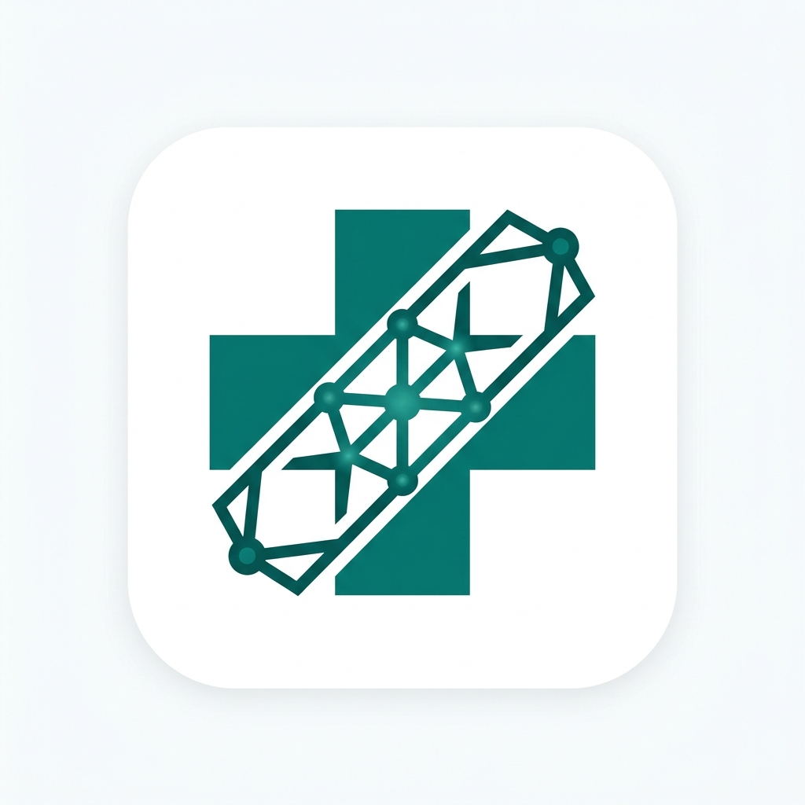

<div align="center">
  
  <h1>CuraLink AI</h1>
  <p><strong>Surgical precision in clinical insight.</strong></p>
  <p>An AI-powered Medical Research Assistant built for complex clinical synthesis.</p>
</div>

<br />

## 🎯 Overview

CuraLink is a full-stack, AI-powered Medical Research Assistant designed to move beyond generic chatbots. It is a true **health research companion** that understands explicit patient context, retrieves high-quality medical literature from primary databases, reasons over immense amounts of data, and delivers structured, highly personalized, and source-backed clinical insights.

Built on the **MERN** stack and powered by **Open-Source LLMs** (via Groq/Ollama), CuraLink ensures that medical reasoning remains transparent, verifiable, and blistering fast.

---

## 🚀 Key Features

* **🧑‍⚕️ Patient-Centric Context:** CuraLink establishes explicit Patient Profiles (Age, Condition, Location, Clinical Notes). Every research query is dynamically personalized based on the active patient profile.
* **🧠 Intelligent Query Expansion:** Natural language queries (e.g., *"Parkinson's DBS"*) are intercepted by the LLM and structurally expanded into hyper-optimized Boolean strings to maximize retrieval quality from external databases.
* **⚡ Parallel "Scatter-Gather" Retrieval:** Interrogates **PubMed**, **OpenAlex**, and **ClinicalTrials.gov** concurrently in real-time. No stale data. 
* **🔍 Semantic Re-Ranking & Synthesis:** Instead of relying on static, outdated Vector DBs, the latest JSON metadata chunks are fed directly into massive LLM context windows (Llama-3), allowing the model to dynamically filter noise and synthesize pure insight.
* **🔒 Air-Gapped Privacy Options:** Seamlessly switch between the ultra-fast **Groq Cloud API** and locally hosted **Ollama** node inference for environments demanding strict HIPAA/GDPR data sovereignty. 

---

## 🏛️ System Architecture

CuraLink operates on a highly decoupled **MERN + Aggregator Architecture**:

1. **Frontend (React, Zustand):** A modern, mobile-responsive SPA offering dynamic workspace layouts, sliding off-canvas menus, and robust state persistence.
2. **Backend (Node.js, Express, MongoDB):** A secure orchestration layer managing JWT authentication, session handling, and stateless API workers.
3. **Retrieval Orchestrator:** Independent worker services that ping diverse medical APIs (ClinicalTrials v2, PubMed eUtils, OpenAlex works) and normalize their disparate schemas.
4. **Inference Layer (LLM):** Real-time markdown streaming, inline citation generation, and complex medical reasoning driven exclusively by open-source foundation models.

---

## 🛠️ Tech Stack

### Client
* **Framework:** React + Vite
* **Routing:** React Router v6
* **State Management:** Zustand (with persist middleware)
* **Styling:** Vanilla CSS + CSS Variables (Deep responsive architecture)

### Server
* **Environment:** Node.js + Express
* **Database:** MongoDB + Mongoose
* **Authentication:** JWT (JSON Web Tokens) + bcryptjs
* **API Ingestion:** Axios (PubMed, OpenAlex, ClinicalTrials.gov)

### AI & Inference
* **Primary Engine:** Groq API (Llama-3 8B / 70B via Language Processing Units for sub-second latency)
* **Local Fallback:** Ollama (Seamless localhost failover for intranet deployments)

---

## ⚙️ Installation & Setup

### Prerequisites
* Node.js (v18+)
* MongoDB (Local or Atlas Atlas cluster)
* Groq API Key (Free tier available)

### 1. Clone the Repository
```bash
git clone https://github.com/yourusername/CuraLink.git
cd CuraLink
```

### 2. Install Dependencies
Install dependencies for both the client and the server.
```bash
# Install server dependencies
cd server
npm install

# Install client dependencies
cd ../client
npm install
```

### 3. Environment Variables
Create a `.env` file in the `/server` directory and configure the following:

```env
PORT=5000
MONGODB_URI=your_mongodb_connection_string
JWT_SECRET=generate_a_strong_random_secret_string
GROQ_API_KEY=your_groq_api_key

# Optional (Defaults to localhost if enabled in UI)
OLLAMA_BASE_URL=http://localhost:11434
```

### 4. Run the Application
You can run the full stack concurrently using standard dev commands:

```bash
# In the /server directory:
npm run dev

# In the /client directory:
npm run dev
```

Visit `http://localhost:5173` in your browser.

---

## 🌐 Deployment Recommendations

For quick, hackathon-ready deployments with zero maintenance:

1. **Database:** Use **MongoDB Atlas** (M0 Sandbox) and whitelist `0.0.0.0/0`.
2. **Backend:** Deploy the `/server` directory to **Render.com**. Ensure your `.env` variables are securely applied in the Render dashboard.
3. **Frontend:** Deploy the `/client` directory to **Vercel**. Set an environment variable in Vercel (`VITE_API_URL`) pointing directly to your live Render backend URL.

*(Note: Ensure your Settings Page uses the Groq setting for cloud deployment, as local Ollama nodes cannot be accessed by public cloud servers unless securely tunneled via utilities like Ngrok).*

---

## 📄 License
This project was built for the AI Medical Research Assistant Hackathon. Code is open-sourced under the MIT License.
